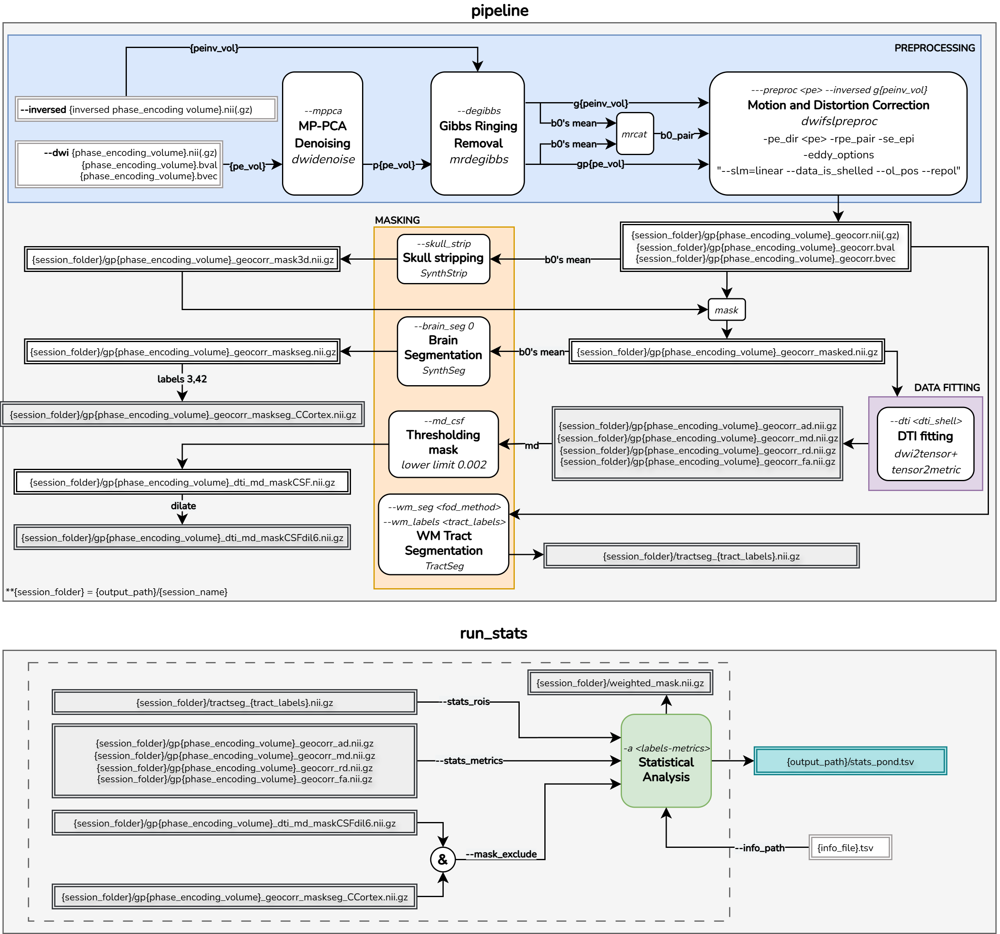

# Docker pipe_dmri: Diffusion MRI Processing Pipeline - "Version v4.0" - remmaria/pipe_dmri:clev_v4

## Folder and Files Structure

The expected structure consists of a `main_folder` containing multiple session folders. Each session folder must include:

- The raw diffusion-weighted image (DWI)
- Its corresponding `.bval` and `.bvec` files (same root name)
- If applicable, a reverse phase-encoding volume

```
# Example:
main_folder/
├── session_01/
│   ├── dwis_PA.nii(.gz)           # Raw DWI image (.nii or .nii.gz)
│   ├── dwis_PA.bval               # b-values
│   ├── dwis_PA.bvec               # b-vectors
│   ├── dwis_AP.nii(.gz)           # Reverse phase-encoded volume (.nii or .nii.gz)
│
├── session_02/
│   ├── ...
```

An output folder path can be provided to store processed files.

```
output_path/
├── session_01/
│   ├── {processed_files}
│   └── stats_analysis.tsv
├── session_02/
│   ├── ...
```
> **Note:** The `{session}` name is inferred from the input path.  
> Example: If `--dwi` is set to `main_folder/session_01/dwis_PA.nii`, the processed files will be saved to `{output_path}/session_01/`.
> If `--output_path` is not specified, the processed files will be saved in the same folder as the input DWI: `main_folder/session_01/`.

## Temporary Folder

If desired, a temporary folder can be specified to store intermediate files (e.g., .mif files). If not provided, the default location is /tmp.
When running on a computing cluster (e.g., CRC), it is recommended to use the $SLURM_SCRATCH directory:

```bash
--tmp_folder $SLURM_SCRATCH
```

## Example Script Usage - scripts pipeline and run_stats

```bash
docker run --rm -v $PWD:$PWD -w $PWD remmaria/pipe_dmri:clev_v4 \
    pipeline \
    --threads $N_CPUS \      # optional:Default 1
    --output_path $output_path \ # optional: Default same folder as input dwi
    --tmp_folder $tmp_folder \  # optional: Default: /tmp
    --dwi main_folder/session_01/dwis_PA.nii.gz \
    --mppca --degibbs --preproc PA --inversed main_folder/session_01/dwis_AP.nii.gz \
    --dti 1000 --skull_strip \
    --wm_seg $fod_method \
    --wm_labels CC,CC_1,CC_2,CC_3,CC_4,CC_5,CC_6,CC_7,CG_left,CG_right,SLF_I_left,SLF_I_right,SLF_II_left,SLF_II_right,SLF_III_left,SLF_III_right \
    --brain_seg 0 \
    --mask_seg '3;42:CCortex' \
    --md_csf 0.002

```
This script performs:

1. `--mppca`: MP-PCA denoising
2. `--degibbs`: Gibbs ringing removal
3. `--preproc PA -i main_folder/session_01/dwis_AP.nii.gz`: Eddy + motion correction (with inverse phase-encoding) - main acquisition = PA
4. `--dti 1000`: DTI fitting considering shell of 1000s/mm2 for AD, MD, RD and FA computing. Adjust this value according to the diffusion sequence used.
5. `--skull_strip`: Skull stripping using SynthStrip.
6. `--wm_seg $fod_method`: WM bundle segmentation using [TractSeg](https://github.com/MIC-DKFZ/TractSeg) - specify FOD method ('csd_msmt' for multi-shell | 'csd' for single-shell).
7. `wm_labels CC...SLF_III_right`:  Use TractSeg in WM Tracts (CC, CC_1–CC_7, CG (RL), SLF_I-III (RL)).
8. `brain_seg 0`: Brain Segmentation using SynthSeg.
9. `mask_seg '3;42:CCortex' `: from SynthSeg mask, generate Cerebral Cortex mask (labels 3 and 42).
10. `md_csf 0.002`: from MD metric, generates a CSF mask using lower threshold of 0.002.

> For best results using TractSeg:
> - Ensure **MNI-compatible orientation** (e.g., like HCP data)
> - Make sure **LEFT hemisphere** is properly aligned
> - Use **isotropic voxel spacing**.
> 
> More info: https://github.com/MIC-DKFZ/TractSeg/tree/master


After processing all sessions, you can run the script `run_stats` using the same docker.

```bash
docker run --rm -v $root_folder:$root_folder remmaria/pipe_dmri:clev_v4\
    run_stats \
    --sessions_folder ${main_folder} \
    --stats_rois tractseg:CC,CC_1,CC_2,CC_3,CC_4,CC_5,CC_6,CC_7,CG_left,CG_right,SLF_I_left,SLF_I_right,SLF_II_left,SLF_II_right,SLF_III_left,SLF_III_right \
    --stats_metrics gpdwis_PA_dti:fa,ad,md,rd \
    --info_path ${info_file} \
    --mask_exclude gpdwis_PA_geomcorr_maskseg_CCortex,gpdwis_PA_dti_md_maskCSFdil6 \
    --verbose
```
1. `--sessions_folder ${main_folder}`:
2. `--stats_rois tractseg:CC...SLF_III_right`: Statistical analysis using TractSeg bundle masks (CC, CC_1–CC_7, CG (RL), SLF_I-III (RL))
3. `--stats_metrics gpdwis_PA_dti:fa,ad,md,rd`: Statistics of DTI metrics (AD, MD, RD, FA) - name of files "gpdwis_PA" - it can vary according to preprocessing steps.
4. `--info_path ${info_file}`: TSV info file (sep=tab) – additional information about each subject/session that can be included in the statistical output. The `{session}` name must match the SessionID column in the TSV file exactly. Works fine without it.
5. `--mask_exclude gpdwis_PA_geomcorr_maskseg_CCortex,gpdwis_PA_dti_md_maskCSFdil6`: masks to exclude from statistics. In this case, Cerebral Cortex and CSF mask from MD dilated once.
6. `--verbose`: show more information while calculating statistics. 

`--sessions_folder` must be the directory that contains all session folders — this is the same as the `main_folder` or `output_folder`, depending on how you configured your pipeline.

This script computes the median, 25th and 75th percentiles, mean, and standard deviation of the specified metrics within ROIs, excluding voxels defined by mask_exclude. In areas where ROIs overlap, the statistics are weighted accordingly—for example, if three masks overlap in a voxel, each contributes with a weight of 1/3 to the calculations.
