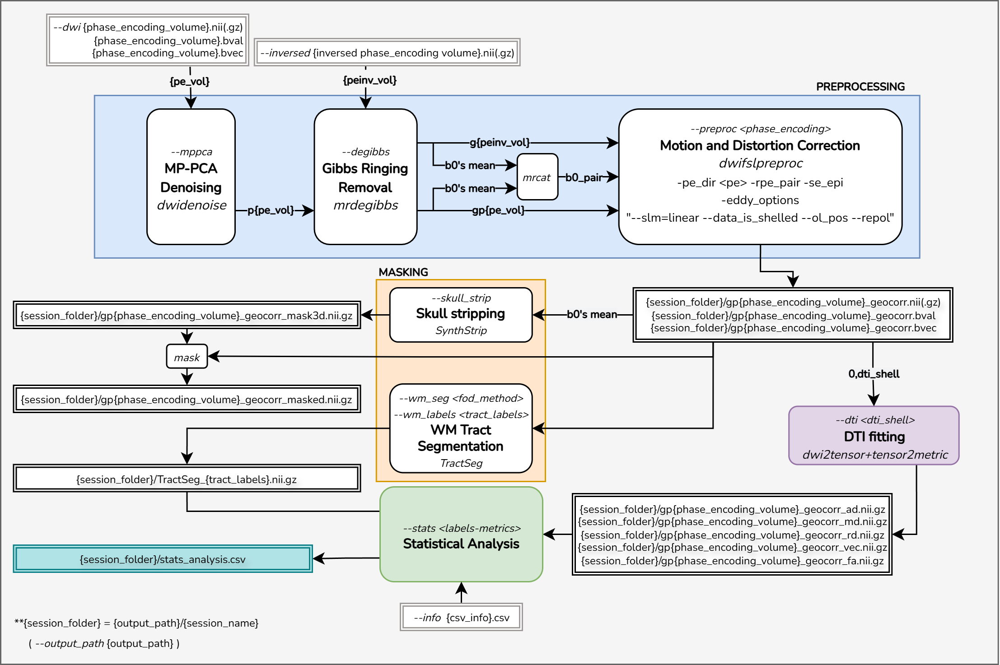

# Docker pipe_dmri: Diffusion MRI Processing Pipeline

## Folder and Files Structure

The expected structure consists of a `main_folder` containing multiple session folders. Each session folder must include:

- The raw diffusion-weighted image (DWI)
- Its corresponding `.bval` and `.bvec` files (same root name)
- If applicable, a reverse phase-encoding volume

```
# Example:
main_folder/
├── session_01/
│   ├── dwis_PA.nii(.gz)           # Raw DWI image (.nii or .nii.gz)
│   ├── dwis_PA.bval               # b-values
│   ├── dwis_PA.bvec               # b-vectors
│   ├── dwis_AP.nii(.gz)           # Reverse phase-encoded volume (.nii or .nii.gz)
│
├── session_02/
│   ├── ...
```

An output folder path can be provided to store processed files.

```
output_path/
├── session_01/
│   ├── {processed_files}
│   └── stats_analysis.tsv
├── session_02/
│   ├── ...
```
> **Note:** The `{session}` name is inferred from the input path.  
> Example: If `--dwi` is set to `main_folder/session_01/dwis_PA.nii`, the processed files will be saved to `{output_path}/session_01/`.
> If `--output_path` is not specified, the processed files will be saved in the same folder as the input DWI: `main_folder/session_01/`.

## Temporary Folder

If desired, a temporary folder can be specified to store intermediate files (e.g., .mif files). If not provided, the default location is /tmp.
When running on a computing cluster (e.g., CRC), it is recommended to use the $SLURM_SCRATCH directory:

```bash
--tmp_folder $SLURM_SCRATCH
```

## Example Script Usage

```bash
docker run --rm -v $PWD:$PWD -w $PWD tsantini/dwipreproc:remmaria_clev \
    --threads $N_CPUS \      # optional:Default 1
    --output_path $output_path \ # optional: Default same folder as input dwi
    --tmp_folder $tmp_folder \  # optional: Default: /tmp
    --dwi main_folder/session_01/dwis_PA.nii.gz \
    --mppca --degibbs --preproc PA --inversed main_folder/session_01/dwis_AP.nii.gz \
    --dti 1000 --skull_strip \
    --wm_seg csd_msmt --wm_labels CC_1,CC_2,CC_3,CC_4,CC_5,CC_6,CC_7,CG_left,CG_right,SLF_I_left,SLF_I_right,SLF_II_left,SLF_II_right,SLF_III_left,SLF_III_right \
    --stats dti-tractseg:CC_1,CC_2,CC_3,CC_4,CC_5,CC_6,CC_7,CG_left,CG_right,SLF_I_left,SLF_I_right,SLF_II_left,SLF_II_right,SLF_III_left,SLF_III_right \
    --info $tsv_info      # optional
```
This script performs:

1. `--mppca`: MP-PCA denoising
2. `--degibbs`: Gibbs ringing removal
3. `--preproc PA -i main_folder/session_01/dwis_AP.nii.gz`: Eddy + motion correction (with inverse phase-encoding) - main acquisition = PA
4. `--dti 1000`: DTI fitting considering shell of 1000s/mm2 for AD, MD, RD and FA computing. Adjust this value according to the diffusion sequence used.
5. `--skull_strip`: Skull stripping using SynthStrip
6. `--wm_seg csd_msmt -l CC_1...SLF_III_right`: WM bundle segmentation using [TractSeg](https://github.com/MIC-DKFZ/TractSeg) with FOD method 'csd_msmt' (multi-shell) for WM Tracts (CC_1–CC_7, CG (RL), SLF_I-III (RL)). Adjust to `csd` for single-shell sequence.
7. `--stats dti-tractseg:CC_1...SLF_III_right`: Statistical analysis using TractSeg bundle masks (CC_1–CC_7, CG (RL), SLF_I-III (RL)) applied to DTI metrics (AD, MD, RD, FA).
8. `--info $tsv_info`: TSV info file (sep=tab) – additional information about each subject/session that can be included in the statistical output. The `{session}` name must match the SessionID column in the TSV file exactly. Works fine without it.

> For best results using TractSeg:
> - Ensure **MNI-compatible orientation** (e.g., like HCP data)
> - Make sure **LEFT hemisphere** is properly aligned
> - Use **isotropic voxel spacing**.
>
> For multi-shell data, you can use other FOD methods: `csd_msmt`, `csd_msmt_5tt`, etc.
> 
> More info: https://github.com/MIC-DKFZ/TractSeg/tree/master

The `pipeline` script generates a `stats_analysis.tsv` file for each session. To speed up processing, you can run sessions independently in parallel. Once all sessions have been processed, you can merge the results using:
```bash
docker run -v $PWD:$PWD -w $PWD pipe_dmri stats_merge --input {input_folder} --output path/to/output/results_merged.tsv
```
Replace `{input_folder}` with the directory that contains all session folders — this is the same as the `main_folder` or `output_folder`, depending on how you configured your pipeline.
